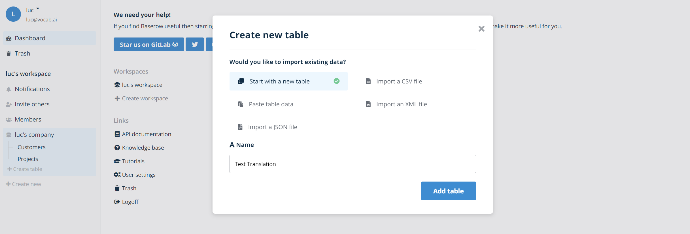
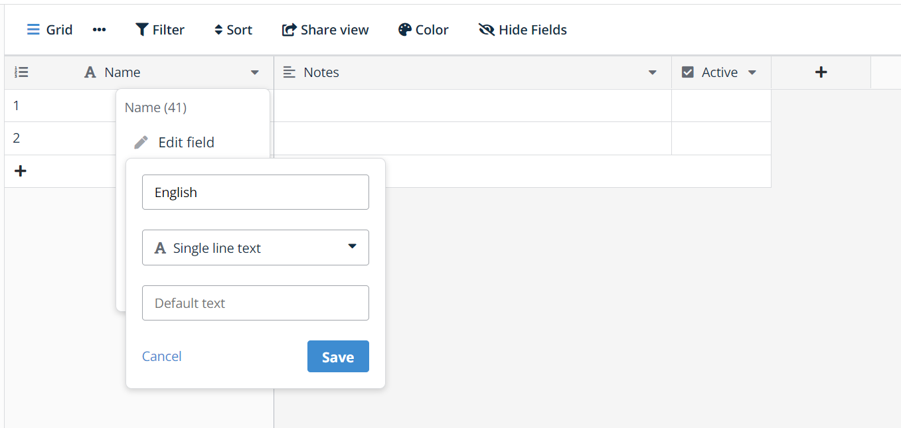
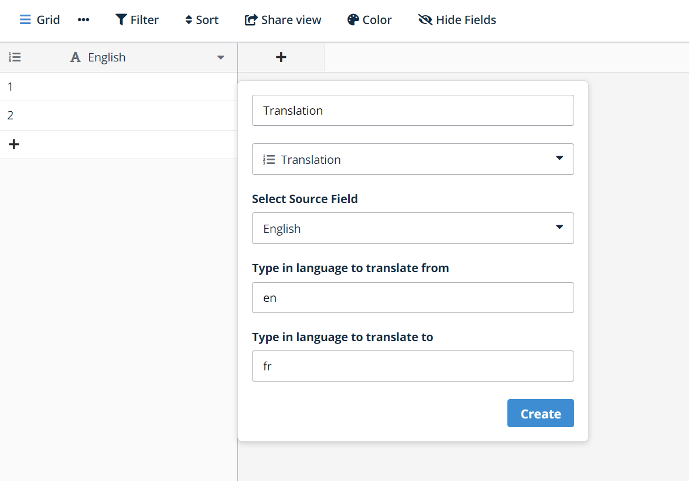
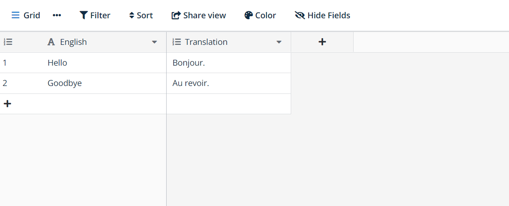
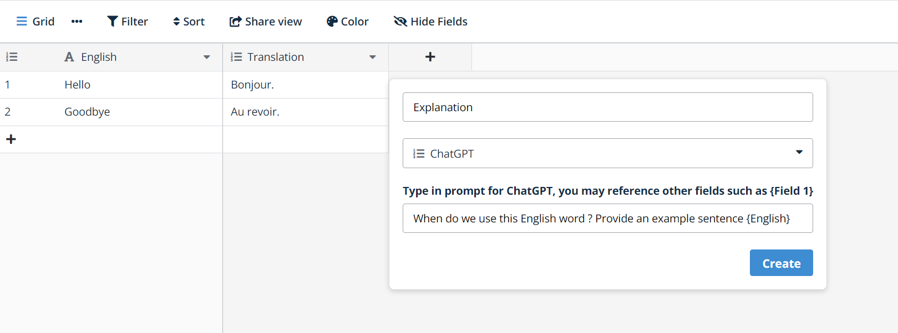
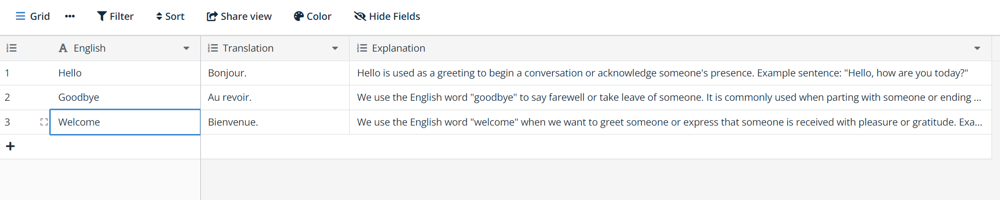

# Run
## Startup Baserow
We are done with all the changes, let's run the baserow plugin. If you have an OpenAI API key, you can set the corresponding environment variable:
```
export OPENAI_API_KEY=<your OpenAI API key>
docker compose -f docker-compose.dev.yml up --build
```
Eventually, you should see this:
```
translate-plugin  |  [WEBFRONTEND][2023-08-31 01:32:39] ℹ Compiling Server
translate-plugin  |  [WEBFRONTEND][2023-08-31 01:32:39] ✔ Server: Compiled successfully in 17.76s
translate-plugin  |  [BASEROW-WATCHER][2023-08-31 01:32:40] Waiting for Baserow to become available, this might take 30+ seconds...
translate-plugin  |  [WEBFRONTEND][2023-08-31 01:32:40] ✔ Client: Compiled successfully in 17.96s
translate-plugin  |  [WEBFRONTEND][2023-08-31 01:32:40] ℹ Waiting for file changes
translate-plugin  |  [WEBFRONTEND][2023-08-31 01:32:40] ℹ Memory usage: 1.12 GB (RSS: 1.59 GB)
translate-plugin  |  [BACKEND][2023-08-31 01:32:42] INFO 2023-08-31 01:32:32,085 daphne.server.listen_success:159- Listening on TCP address 127.0.0.1:8000
translate-plugin  |  [BACKEND][2023-08-31 01:32:42] INFO 2023-08-31 01:32:42,225 django.channels.server.log_action:168- HTTP GET /api/settings/ 200 [0.05, 127.0.0.1:52476]
translate-plugin  |  [BACKEND][2023-08-31 01:32:42] INFO 2023-08-31 01:32:42,225 django.channels.server.log_action:168- HTTP GET /api/settings/ 200 [0.05, 127.0.0.1:52476]
translate-plugin  |  [BACKEND][2023-08-31 01:32:42] INFO 2023-08-31 01:32:42,269 django.channels.server.log_action:168- HTTP GET /api/auth-provider/login-options/ 200 [0.04, 127.0.0.1:52480]
translate-plugin  |  [CADDY][2023-08-31 01:32:42] {"level":"info","ts":1693445540.1934621,"msg":"serving initial configuration"}
translate-plugin  |  [BASEROW-WATCHER][2023-08-31 01:32:50] Waiting for Baserow to become available, this might take 30+ seconds...
translate-plugin  |  [BASEROW-WATCHER][2023-08-31 01:32:50] =======================================================================
translate-plugin  |  [BASEROW-WATCHER][2023-08-31 01:32:50] Baserow is now available at http://vocabai.webdev.ipv6n.net:8000
translate-plugin  |  [BACKEND][2023-08-31 01:32:50] INFO 2023-08-31 01:32:42,269 django.channels.server.log_action:168- HTTP GET /api/auth-provider/login-options/ 200 [0.04, 127.0.0.1:52480]
translate-plugin  |  [BACKEND][2023-08-31 01:32:50] INFO 2023-08-31 01:32:50,229 django.channels.server.log_action:168- HTTP GET /api/_health/ 200 [0.01, 127.0.0.1:53788]
translate-plugin  | 2023-08-31 01:32:50,231 INFO success: caddy entered RUNNING state, process has stayed up for > than 30 seconds (startsecs)
```

Note that the URL will be different in your case.

## Try out the new field types
Login to your baserow instance running the plugin. In my case, I need to go to `http://vocabai.webdev.ipv6n.net:8000`, create a user, then I have access to the dashboard. I then create a new table:

I modify the *Name* field, I want that to be my *English* field:

Then, I create a French translation field:

You should see the automatic translation take place when you edit text in the *English* field.

Now, let's add a ChatGPT field, we'll ask a question about the English text, though you could ask for a translation, using the right prompt.

You should see the result of the ChatGPT queries:


## This is the end of the tutorial 
Need more information ? https://baserow.io/docs/ or https://community.baserow.io/ .